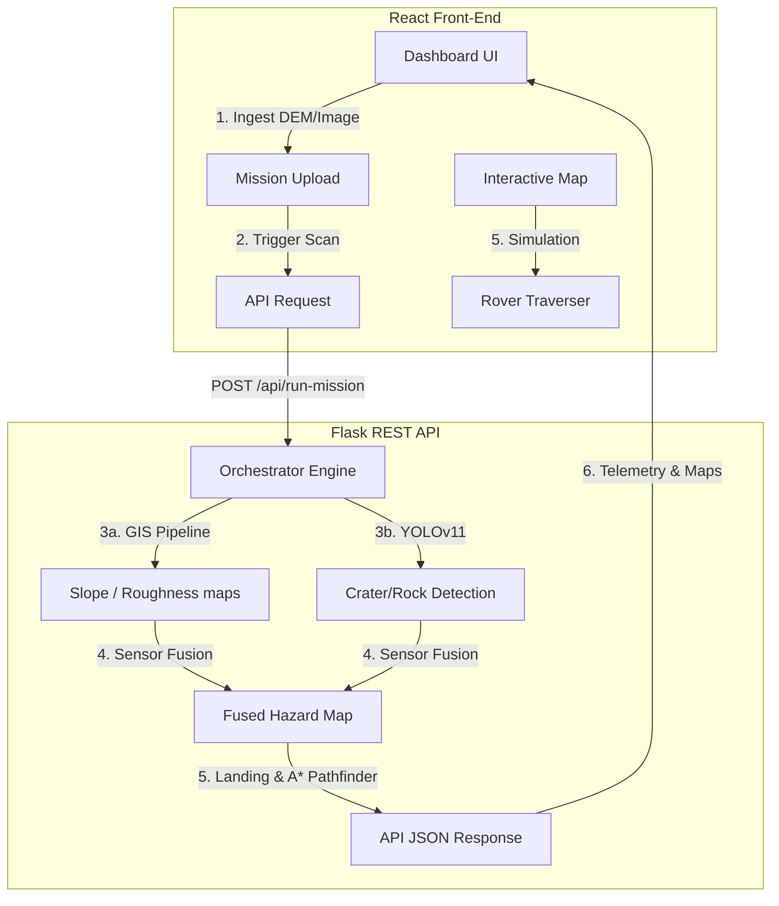

# 🌙 Lunar AI — AI-Assisted Lunar Terrain Analysis & Safe Rover Navigation

> **Smart India Hackathon (SIH) Final Round Presentation Ready** — An advanced mission-planning and terrain analysis software suite designed to identify safe lunar landing sites and optimize rover navigation pathways. It dynamically fuses high-resolution Digital Elevation Models (DEM) with real-time YOLOv11 crater/rock object detection.

---

## 🎯 Features Checklist

* [x] **Geomorphology Processing**: Extracts slope angles and surface roughness indices directly from DEM GeoTIFF files.
* [x] **Computer Vision Hazards**: Employs custom-trained YOLOv11 weights to detect craters and rock hazard boundaries.
* [x] **Sensor Fusion Engine**: Merges elevation gradients with neural network bounding boxes to construct a unified hazard map.
* [x] **Explainable AI (XAI)**: Displays an Artemis tip-over compliance checklist for each site, explaining safety scores in plain language.
* [x] **A* Pathfinding**: Calculates optimal path waypoints, driving distance, transit time, and battery consumption rates.
* [x] **Responsive Map Layers**: Interactive overlays (coordinates grid, YOLO detections, safe zones) toggleable on/off.
* [x] **Telemetry Simulator**: Simulates descent maneuvers and de-orbit checklist executions.

---

## 🏗️ Architecture Overview

The platform uses a decoupled client-server architecture. The Flask backend manages geomorphology calculations and YOLO inferences, while the React/Vite client handles UI rendering and path simulation.



---

## 🧠 Processing Pipeline Details

The orchestrator executes a 10-stage sequential pipeline to translate raw elevation grids into actionable navigation waypoints.

```mermaid
graph LR
    A[DEM Ingestion] --> B[Elevation map]
    B --> C[Anisotropic Slope]
    C --> D[Vectorized Roughness]
    D --> E[Terrain Classify]
    E --> F[YOLO Image Scan]
    F --> G[Sensor Fusion]
    G --> H[Site Recommendation]
    H --> I[A* Route Planner]
    I --> J[Telemetry Output]
    
    style G fill:#f9f,stroke:#333,stroke-width:2px
    style J fill:#bbf,stroke:#333,stroke-width:2px
```



---

## 📁 Repository Structure

```
d:\sipun\
├── backend/                       ← Flask REST API & Processing Pipeline
│   ├── app.py                     ← App server, CORS middleware, API routers
│   ├── mission_engine.py          ← 10-stage pipeline orchestrator
│   ├── fusion_engine.py           ← Normalizes and merges YOLO boxes with DEM
│   ├── terrain/                   ← Raster processing modules
│   │   ├── read_dem.py            ← Extracts pixel size spacing
│   │   ├── slope_map.py           ← Anisotropic gradient calculation
│   │   ├── roughness_map.py       ← Vectorized uniform_filter std dev
│   │   └── ...
│   ├── planning/
│   │   ├── landing_selector.py    ← Artemis safety site selector
│   │   └── path_planner.py        ← Anisotropic A* pathfinder
│   ├── validation/
│   │   └── sanity_check.py        ← Artemis landing site validation report
│   └── requirements.txt
├── lunar-ops-ai/                  ← React Mission Control Frontend
│   ├── src/
│   │   ├── components/            ← Modular Dashboard Panels
│   │   │   ├── Home.tsx           ← Hero & Pipeline Stepper
│   │   │   ├── MissionUpload.tsx  ← Drag & Drop Ingestion
│   │   │   ├── TerrainPanel.tsx   ← Zoomable geomorphology maps
│   │   │   ├── HazardPanel.tsx    ← Dynamic layer overlays
│   │   │   ├── LandingPanel.tsx   ← Ranked cards & XAI checklist
│   │   │   ├── RoverPanel.tsx     ← Path telemetry & Animated movement
│   │   │   ├── MissionSummary.tsx ← Printable operations log
│   │   │   └── Settings.tsx       ← Threshold calibrations
│   │   ├── App.tsx                ← Shared State Orchestrator
│   │   └── index.css              ← Tactical grid animations & styling
├── weights/                       ← Custom-Trained YOLO v11 weights
│   ├── best.pt                    ← Optimal crater/rock model weights
│   └── last.pt
└── legacy_archive/                ← Archived prototype files (Reference only)
```

---

## ⚡ Performance Benchmarks

* **Local std dev Calculation**: Vectorized standard deviation calculation inside `roughness_map.py` utilizing `scipy.ndimage.uniform_filter` yields a **~389x speedup** compared to `scipy.ndimage.generic_filter`.
* **Automatic Downsampling**: DEM inputs larger than 2000px in width or height are downsampled dynamically before geomorphology extraction to prevent CPU memory bottlenecks, and upsampled back to native sizes to maintain scale consistency.

---

## 🚀 Installation & Operation

### Prerequisites
* Python 3.10+
* Node.js 18+

### 1. Flask Backend Setup
Navigate to the backend directory, initialize a virtual environment, and install dependencies:
```bash
cd backend
python -m venv .venv
.venv\Scripts\activate
pip install -r requirements.txt
python app.py
```
*Backend listens on `http://127.0.0.1:5000`.*

### 2. Frontend Dashboard Setup
Navigate to the React workspace, install package files, and launch the server:
```bash
cd lunar-ops-ai
npm install
npm run dev
```
*Frontend dev server serves on `http://localhost:5173`.*

---

## 🌐 Flask API Specifications

### `POST /api/upload`
Uploads a DEM raster (`.tif`) or orbital image (`.jpg`/`.png`) to the workspace server directory.
* **Payload**: `file` (form-data).
* **Response**: `200 OK` (JSON success confirmation).

### `POST /api/run-mission`
Triggers the orchestrator pipeline over the loaded files.
* **Payload**:
  ```json
  {
    "slope_threshold": 15,
    "confidence_threshold": 0.95
  }
  ```
* **Response**:
  ```json
  {
    "elevation": { "min": 0, "max": 120, "mean": 60, "shape": [128, 205] },
    "terrain_stats": { "safe_pct": 78.2, "caution_pct": 14.5 },
    "landing_sites": [
      {
        "rank": 1,
        "name": "SITE ALPHA",
        "coordinates": "25.4° N, 138.2° E",
        "safety_score": 96,
        "slope": 2.1,
        "safety_score_explanation": "Safety score of 96% represents..."
      }
    ],
    "rover_path": { "waypoints": [[10, 20], [12, 22]], "estimated_distance_m": 3450 },
    "maps": {
      "elevation": "data:image/png;base64,...",
      "fused_hazard": "data:image/png;base64,..."
    }
  }
  ```

---

## ⚠️ Known Limitations
* **DEM Channel constraints**: Input DEM rasters must be single-band TIFF files where pixel values map directly to elevation values.
* **Aspect Spacings**: Anisotropic resolutions are supported, but must be represented within the GeoTIFF geotransform metadata.

---

## 🔮 Future Scope
* **Solar Irradiation Modeling**: Simulating shadow movement based on landing epoch inputs to maximize solar panel charging rates.
* **Crater Depth Estimations**: Running height-from-shadow profiling on optical images to cross-correlate crater depth measurements when elevation DEM models are unavailable.
